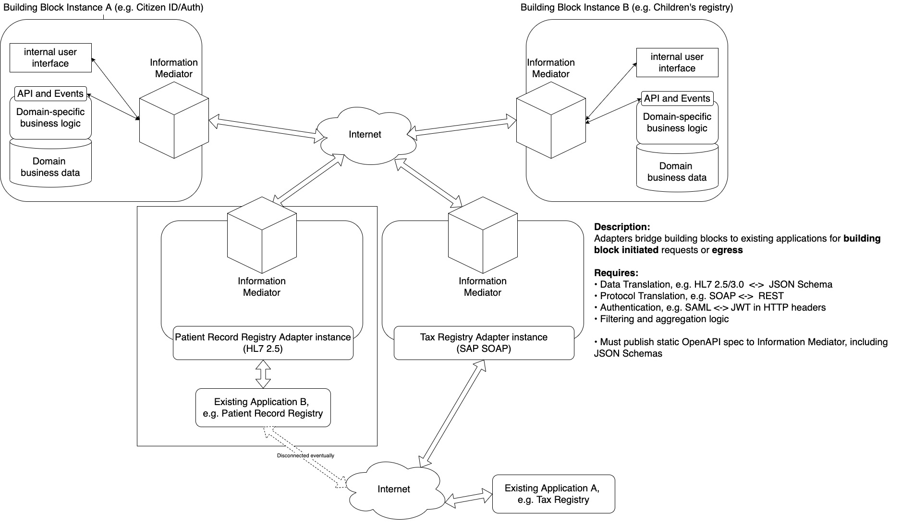

# 6 Onboarding Products

It is vital that GovStack be able to connect to existing applications. Likewise, existing applications should be able to connect to and utilize GovStack resources as they see fit. This must be done without compromising the easy and secure interoperability provided by the GovStack system.

This section describes a phased approach that existing platforms may use to integrate into a GovStack implementation. These phases are as follows:

* Adaptors
* API Gateways
* Native GovStack implementation

This can be accomplished with Adapters that connect existing applications for use by GovStack and API Gateways that provide secure access to GovStack services for citizens and other applications, including existing applications.

_Note: GovStack is developing a formal compliance process. Progress and updates on this process can be tracked here:_ [_https://govstack-global.atlassian.net/wiki/spaces/GH/pages/76906515/Compliance+Concept+and+Integration+Scenarios_](https://govstack-global.atlassian.net/wiki/spaces/GH/pages/76906515/Compliance+Concept+and+Integration+Scenarios)__

### 6.1 Adapters

Adapters connect GovStack building blocks to existing applications. There are many possible flavors of adapter, e.g. HL7 2.5, HL7 3.0, FHIR, SAP SOAP, SQL and many others. Each flavor can be quickly configured to give GovStack access to existing resources.

Adapters are responsible for data and protocol translation, authentication, and filtering and aggregation logic. They publish an OpenAPI specification via Information Mediator so they can be used by any building block.

Here we can see two adapters, one for patient records and another for a tax registry:

In this example, an HL7 2.5 adapter connects an existing application’s patient record registry, and an SAP SOAP adapter connects an existing applications tax registry to GovStack. Both adapters provide services that are available for use by other building blocks.

If an existing application sends events, they are exposed as webhooks in the adapter’s OpenAPI specification like other APIs. This allows any GovStack building block to be notified when the event occurs.

### 6.2 API Gateways

API gateways connect citizens and existing applications to GovStack building blocks. Here, a public API gateway provides GovStack resources to citizens, while a private API gateway provides GovStack resources to existing applications:

.png>)

In this example, a hospital information management system can use the Citizen ID/Auth building block to authenticate a patient’s foundational ID. Likewise, citizens access government services via external mobile or web applications calling through a shared public API gateway.

Any number of API gateways can be added to expose various GovStack services to users or external applications, each of which have different security requirements on the information mediator and public internet/API Gateway sides.

### 6.3 Native GovStack Implementation

This shows a complete GovStack deployment with API gateways for citizen access via web or mobile and for existing applications to be able to call GovStack APIs on demand. The workflow building block is used as an adapter, exposing existing applications as GovStack resources via OpenAPI:

.png>)

Here, citizens and existing applications are provided API access for requests into GovStackvia a common API Gateway, while the workflow building block/adapter provides outgoing API access to existing applications from GovStack building blocks.
