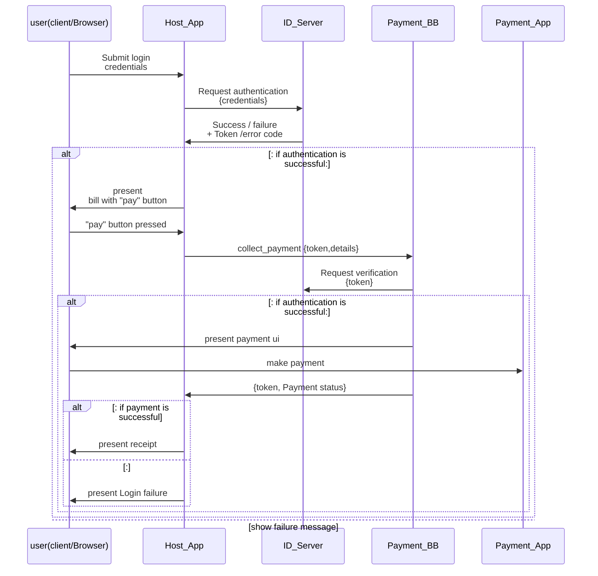
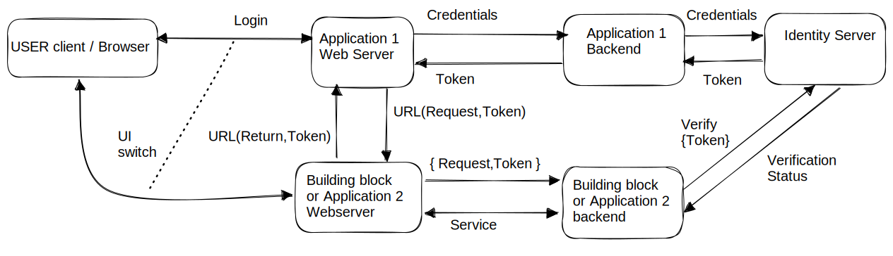
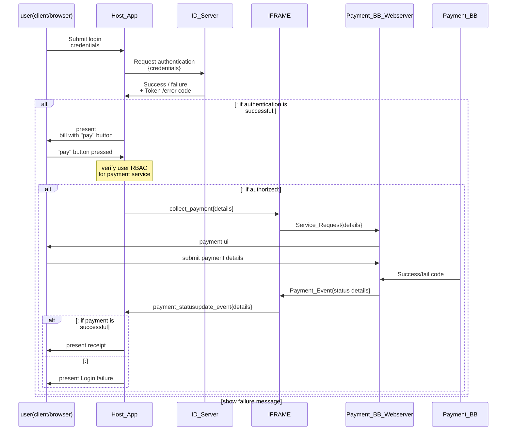
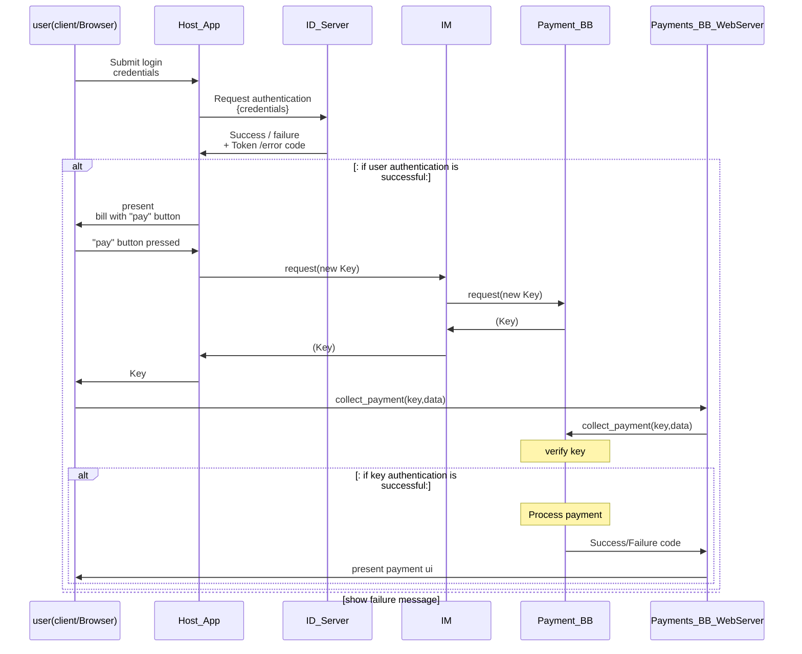

# 8 UX Switching and Handover

Govstack architecture enables an application to call services of another application within Govstack and get responses containing information from the called application.   In many cases, control over the User Interface may need to be passed from an application to another Building Block. For example, if a user is doing a biometric or multi-factor authentication, the ID Building Block can present the UX to the user for that process. If a user is sending or receiving a payment, the UX can be handed off to the Payment Building Block for the user to enter account information for the payment. In general UI level switching may be necessary because

a.       The called service may collect inputs from the user directly through its own UI as it is not preferred to exposed collected data collection to the calling application for security reasons.

b.       It may be unreasonable to expect that the calling application designs screens of other Building blocks it calls, considering diverse requirements, standards, policies, etc., in respective domains.

c.       Building blocks may be developed by different entities and evolve independently. Hence tight integration is not preferred, loosely coupled but secure interoperability is needed.

If the applications needing a service and the application providing the service are not co-located, then some control and data exchanges are needed at UI level, a secure authentication mechanism is needed before the service is provided. A few authentication mechanisms relevant to UI level switching between independent applications are discussed below:

Considering for example, a citzen already registered in a Govstack logs into the energy deparment's application to pay an eletricity bill. The application will submit the user's  login credentials to an Identity server at its backend and gets in return a session token for that user, if authenticated successfully. On its UI the application presents a due electricity bill along with "Pay" button. When the user clicks the "pay" button, the application UI redirects the user to a payment building block ui to collect relevant payment. After payment is remitted the payment building block  redirects back to the Energy dept application to confirm successful payment after which the application may present a receipt generated for the user.&#x20;

Given that context, the following ways are possible for UX switching:

**1. OpenID Connect based Single Sign-On (SSO)**

A Single Sign On (SSO) system can be used, which allows an authentication token to be passed from the application to another Building Block. An authorization server is used to handle the initial user login and the access token received from the auth server can be passed to other Building Blocks and used to authorize access to the Building Block functionality.

1. OpenID Connect based Single Sign-On (SSO): SSO allows users to authenticate once and access multiple applications without the need for repeated login prompts adopting popular SSO protocols such as OAuth authorization and OpenID connect. OAuth framework allows users to grant access to their resources without sharing their credentials with the requesting application. It enables a user to authenticate with one application (called the "identity provider" or "authorization server") and obtain an access token. This access token can then be used to access protected resources in other applications (called "resource servers") without requiring the user to authenticate again. OpenID Connect facilitates SSO by allowing users to authenticate once with the identity provider and then access multiple applications without repeated login prompts. This improves user experience and reduces the need for managing multiple sets of credentials. The OpenID Connect builds upon OAuth 2.0 to provide user authentication as well as authorization. It allows for identity information to be exchanged between the identity provider and relying applications. When a user authenticates with the identity provider, the relying application (service provider) receives an ID token containing information about the user. This ID token can be used to authenticate the user in the relying application by cross verification with the identity server.

This mechanism has some inherent advantages such as:

_Enhanced User Authentication:_ OpenID Connect provides a standardized and robust mechanism for user authentication. It allows for the exchange of identity information between the identity provider and relying applications, enabling stronger authentication and verification of user identities.

_Standardized Protocol:_ OpenID Connect is widely adopted and standardized, making it easier to implement and integrate with various applications and platforms. It provides clear guidelines and specifications, reducing the complexity of authentication implementation.

_User Profile and Attributes:_ OpenID Connect allows for the retrieval of user profile information and additional attributes from the identity provider. This can provide valuable user data to relying applications for personalization, authorization, and user-specific functionality.

There are some inherent disadvantages of OpenID Connect as well:

_Authentication:_  The called application gets user authentication, but not authentication of the calling application,  especially when the two applications are not colocated physically.&#x20;

_Increased Complexity:_ Implementing OpenID Connect can be more complex compared to token-based authentication or secure proxy methods. It requires understanding the underlying OAuth 2.0 framework and configuring the identity provider and relying applications accordingly.

_External Dependency:_ OpenID Connect relies on an external identity provider for user authentication. This introduces a dependency on the availability and reliability of the identity provider. If the identity provider experiences issues, it can affect the authentication process for the relying applications.

_Single point of failure_: Centralized Identity server may lead to single point of failure, but leads to consistency and focus on  managing security concerns at one place in the architecture.

**2. IFRAME based Secure Proxy Authentication**

In this case the calling application UI has an embedded screen component (iframe) that internally points to the called application’s webserver URL. Information within the iframe can be isolated from the main application or may exchange select information through triggered “events” exposed between them. An iframe (inline frame) is a HTML element that allows one to embed one HTML document within another. In the context of authentication and secure redirection between UIs of different web applications, iframes are typically used as a part of the secure proxy mechanism. Specifically, iframes can be used within the secure proxy to load and display content from a different web application or domain while maintaining the security boundaries between the two applications. The iframe can serve as a container for displaying the UI of the target application within the UI of the calling application. The use of iframes in this context is often employed to achieve seamless integration and user experience between different web applications, allowing for the rendering of UI components from multiple sources within a single interface.

Assuming the user has already logged into the parent (calling) application, then some action in the main application screen (like clicking "pay" button may invoke the iframe, the application verifies role based access permissions of the user to invoke payment BB service and then transfer control to the IFRAME, which inturn invokes the UI of the called application/BB which is linked to the iframe at build time. The Payment BB receives the request, presents its ui in the iframe and finishing its business it posts a status update event in the IFRAME with relevant details. The IFRAME relays the event to calling application and then the application will process the details and further steps appropriately.

The secure proxy mechanism provides several advantages:

_Centralized Security:_ By intercepting and controlling client requests, one can enforce security policies consistently across multiple applications and services. The calling application owns the responsibility to use the secure proxy as a central point for authentication and authorization, while the called applications need not handle these concerns and rely on the calling application as source of truth.

_Simplified Logic:_ With a secure proxy handling authentication and authorization in the parent application, called applications can focus on their core functionalities rather than implementing these security mechanisms independently. This simplifies application development and maintenance.

However, it has some limitations and challenges:&#x20;

The calling application places trust and control in the calling application hence the Risk of serving a calling application that is already compromised.&#x20;

Since applications and BBs may be typically separate third party products their developments may not be synchronized.&#x20;

It is important to note that the secure proxy mechanism introduces an additional component to the architecture, which requires proper configuration, maintenance, and monitoring. It also adds an extra network hop and potential performance overhead, so it's crucial to ensure that the proxy infrastructure is appropriately scaled and optimized to handle the expected traffic.&#x20;

The specific implementation of the secure proxy mechanism can vary based on the chosen proxy software or infrastructure components.

3. **Key-based, decentralized Authentication**

This method involves generating and exchanging dynamically generated key between the applications. Assuming the user has already authenticated and logged into first application the user starts transaction in that application. When the user clicks a relevant button (e.g. "pay") on the screen of that application, the application obtains a unique temporary key from the target application by making a specific api request through the information mediator. Then the application's frontend redirects to the URL of webserver of the target BB/application  and passes the key along with other relevant data. The called application validates the key internally before providing the UI to complete payment transaction. After completion the BB's backend returns the passed/failed status to its front end ui. The UI then redirects back to the calling application returning the status as a payload. JSON Web Tokens (JWT) is a commonly used token format.

This mechanism has some advantages:

_Simplicity and Flexibility:_ Token-based authentication, such as JWT, is generally simpler to implement and understand compared to OIDC. It provides flexibility in how tokens are generated, validated, and managed, allowing for customization based on specific requirements.

_Decoupled Architecture:_ Key-based authentication enables a decoupled architecture where the authentication process is not dependent on the identity provider. It also distributes key-based authentication process load across called BB/Applications and not on centralized server. Hence is also not dependent on a single-point-of-failure.&#x20;

_Scalability_: Key-based authentication can be more scalable since it does not require communication with an identity provider for authentication. The server can verify the token locally, reducing external dependencies and potential bottlenecks.

_Dynamic provisioning:_ Since what is contained in a key is decided by the called application, it is possible to generate unique keys for each service call (instead of session wide tokens) enabling higher level of security.

There are some inherent disadvantages of Token-Based Authentication as well:

_Lack of Standardization:_ Although JSON Web Tokens (JWT) signed by JSON Web keys (JWK)  are standard formats for encapsulating unique authentication information, the actual payload of a key is not a standardized specification for authentication. This can result in varied implementations and interoperability challenges when integrating with different systems and applications.

_Authentication:_  The called application gets authentication of the calling application because it gets request for key through the backend via Information mediator, which allows only registered applications to send requests. However, this does not authenticate the user. It trusts that the calling application has appropriately authenticated the user.

_Additional Development Effort:_ Implementing token-based authentication may require more development effort to handle aspects such as token generation, validation, and session management. Customization and maintenance of these components can be time-consuming.

**4. Hybrid Model**

This is a combination of openID connect and Token based connect models and hence advantages of both user and application authentication. In this case the user logs in into the the calling application/building block(in this example, Registration), which authenticates the user credentials from an identity server and obtains a unique session token for that user. The registration process may collect required details and present a “payment” button to the user. When the user clicks it, the application will send a request for a one time key from the called building block(in this example, the Payment building block). It then redirects to the url of payments BB page and passes the user token and the key as part of the payload it needs to transfer to payments BB. The payments BB now verifies the key to make sure a valid registered application is sending the request and then authenticates the user token with the identity server to ensure an authorized user is requesting the service. After confirming this, it will put up the required UI page for collecting user payment. Once the payment process is complete it will redirect back to the calling application screen url, along with the payload containing the same token, key along with success/failure status code. This switching can be multilevel in the sense that the same protocol can be used by payments building block to switch to another building block at the front end if required. In such a case the returning path shall also be in the reverse order of the forward switching path, so that appropriate keys are used in each nested branch.

Any of these mechanisms may be used, depending on the implementation. In general GovStack recommends option 1 or option 4.

The various approaches and recommendations, along with technical specifications for UX switching are outlined in detail in this document: [GovStack UX Switching](https://govstack-global.atlassian.net/wiki/spaces/GH/pages/270139400/UX+Switching)&#x20;
