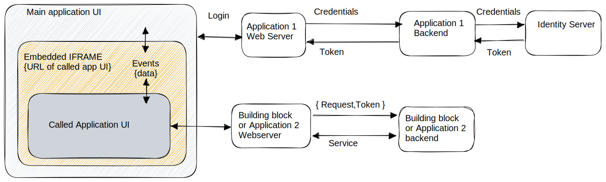

# 8 UX Switching and Handover

Govstack architecture enables an application to call services of another application within Govstack and get responses containing information from the called application.   In many cases, control over the User Interface may need to be passed from an application to another Building Block. For example, if a user is doing a biometric or multi-factor authentication, the ID Building Block can present the UX to the user for that process. If a user is sending or receiving a payment, the UX can be handed off to the Payment Building Block for the user to enter account information for the payment. In general UI level switching may be necessary because

a.       The called service may collect inputs from the user directly through its own UI as it is not preferred to exposed collected data collection to the calling application for security reasons.

b.       It may be unreasonable to expect that the calling application designs screens of other Building blocks it calls, considering diverse requirements, standards, policies, etc., in respective domains.

c.       Building blocks may be developed by different entities and evolve independently. Hence tight integration is not preferred, loosely coupled but secure interoperability is needed.

If the applications needing a service and the application providing the service are not co-located, then some control and data exchanges are needed at UI level, a secure authentication mechanism is needed before the service is provided. A few authentication mechanisms relevant to UI level switching between independent applications are discussed below:

Considering for example, a citzen already registered in a Govstack logs into the energy deparment's application to pay an eletricity bill. The application will submit the user's  login credentials to an Identity server at its backend and gets in return a session token for that user, if authenticated successfully. On its UI the application presents a due electricity bill along with "Pay" button. When the user clicks the "pay" button, the application UI redirects the user to a payment building block ui to collect relevant payment. After payment is remitted the payment building block  redirects back to the Energy dept application to confirm successful payment after which the application may present a receipt generated for the user.&#x20;

Given that context, the following ways are possible for UX switching:

**1. OpenID Connect based Single Sign-On (SSO)**

A Single Sign On (SSO) system can be used, which allows an authentication token to be passed from the application to another Building Block. An authorization server is used to handle the initial user login and the access token received from the auth server can be passed to other Building Blocks and used to authorize access to the Building Block functionality.

1. OpenID Connect based Single Sign-On (SSO): SSO allows users to authenticate once and access multiple applications without the need for repeated login prompts adopting popular SSO protocols such as OAuth authorization and OpenID connect. OAuth framework allows users to grant access to their resources without sharing their credentials with the requesting application. It enables a user to authenticate with one application (called the "identity provider" or "authorization server") and obtain an access token. This access token can then be used to access protected resources in other applications (called "resource servers") without requiring the user to authenticate again. OpenID Connect facilitates SSO by allowing users to authenticate once with the identity provider and then access multiple applications without repeated login prompts. This improves user experience and reduces the need for managing multiple sets of credentials. The OpenID Connect builds upon OAuth 2.0 to provide user authentication as well as authorization. It allows for identity information to be exchanged between the identity provider and relying applications. When a user authenticates with the identity provider, the relying application (service provider) receives an ID token containing information about the user. This ID token can be used to authenticate the user in the relying application by cross verification with the identity server.


This mechanism has some inherent advantages such as:

_Enhanced User Authentication:_ OpenID Connect provides a standardized and robust mechanism for user authentication. It allows for the exchange of identity information between the identity provider and relying applications, enabling stronger authentication and verification of user identities.

_Standardized Protocol:_ OpenID Connect is widely adopted and standardized, making it easier to implement and integrate with various applications and platforms. It provides clear guidelines and specifications, reducing the complexity of authentication implementation.

_User Profile and Attributes:_ OpenID Connect allows for the retrieval of user profile information and additional attributes from the identity provider. This can provide valuable user data to relying applications for personalization, authorization, and user-specific functionality.

There are some inherent disadvantages of OpenID Connect as well:

_Authentication:_  The called application gets user authentication, but not authentication of the calling application,  especially when the two applications are not colocated physically.&#x20;

_Increased Complexity:_ Implementing OpenID Connect can be more complex compared to token-based authentication or secure proxy methods. It requires understanding the underlying OAuth 2.0 framework and configuring the identity provider and relying applications accordingly.

_External Dependency:_ OpenID Connect relies on an external identity provider for user authentication. This introduces a dependency on the availability and reliability of the identity provider. If the identity provider experiences issues, it can affect the authentication process for the relying applications.

_Single point of failure_: Centralized Identity server may lead to single point of failure, but leads to consistency and focus on  managing security concerns at one place in the architecture.

**2. IFRAME based Secure Proxy Authentication**

In this case the calling application UI has an embedded screen component (iframe) that internally points to the called application’s webserver URL. Information within the iframe can be isolated from the main application or may exchange select information through triggered “events” exposed between them. An iframe (inline frame) is a HTML element that allows one to embed one HTML document within another. In the context of authentication and secure redirection between UIs of different web applications, iframes are typically used as a part of the secure proxy mechanism. Specifically, iframes can be used within the secure proxy to load and display content from a different web application or domain while maintaining the security boundaries between the two applications. The iframe can serve as a container for displaying the UI of the target application within the UI of the calling application. The use of iframes in this context is often employed to achieve seamless integration and user experience between different web applications, allowing for the rendering of UI components from multiple sources within a single interface.




```mermaid
```

3. **Token-based, decentralized Authentication**

In this method, a user authenticates in the application and a token is issued when the user starts a transaction. When the user clicks a relevant button on the screen of the application, it calls a UI of the Building Block at a predefined URL endpoint and passes the token along with any other information necessary. The same token is also passed to a secure backend API of the Building Block through the Information Mediator by the calling application backend.

**4. Hybrid Model**

This is a combination of openID Connect and Token based connect models and hence has advantages of both user and application authentication. This method requires more overhead, but ensures security on both the front-end and back-end. The application passes a token to the called Building Block through the Information Mediator, ensuring a valid registered application is sending the request. In addition, the called Building Block can authenticates a valid user with the authorization service.


Any of these mechanisms may be used, depending on the implementation. In general GovStack recommends option 1 or option 4.

The various approaches and recommendations, along with technical specifications for UX switching are outlined in detail in this document: [GovStack UX Switching](https://govstack-global.atlassian.net/wiki/spaces/GH/pages/270139400/UX+Switching)&#x20;
