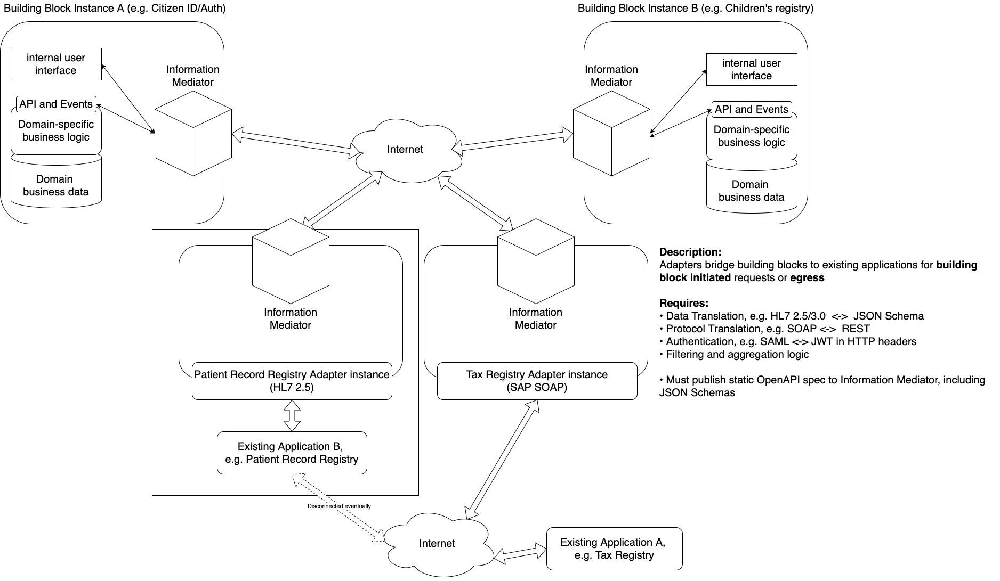

# 2 Description

This document is intended for building block working groups and developers. It provides guidelines and principles that should be considered by all building blocks. It also provides cross-cutting requirements that must be considered

GovStack aims to provide a reference architecture for digital governance software to support sustainable development goals. We’ve seen the many benefits digitalization of governance can bring. We believe that leveraging a Whole-of-Government approach rooted in common building block technologies can help accelerate this process around the world.

The goal of GovStack is will accelerate the collaborative development of interoperable digital public goods, enhancing efficiency and transparency across the world - especially in low-resource settings. The guidelines and requirements described in this document provide a framework for the development of digital building blocks oriented toward this goal.&#x20;

## 2.1 Considerations for Low-Resource Settings

Low-resource settings have unique constraints that must be considered.

Here is a list of indicators with high-level descriptions:

| Indicator                                   | Description                                                                                                                                                                                                                                                                                                 |
| ------------------------------------------- | ----------------------------------------------------------------------------------------------------------------------------------------------------------------------------------------------------------------------------------------------------------------------------------------------------------- |
| ICT Governance                              | Poor or non-existent National ICT governance structure that makes decisions and ensures accountability framework to encourage desirable behavior in the use of ICT in the country. However, this may be described in documents but the implementation is suboptimal or not enforced.                        |
| Government ICT policy or Framework          | No strategic policy framework for the acquisition and use of IT for social and economic growth in the country. The policy might be at the development stage and where the policy exists, the policy implementation is lagging or non-existent.                                                              |
| ICT infrastructure                          | The development of IT infrastructure in the country is lagging behind or sub optimal because of poor policies and insufficient investments in the ICT sector. Low coverage of power or the national grid and little penetration of alternative sources of energy especially in the rural.                   |
| Financial Resources and Investments in ICT  | Limited funding for ICT projects and initiatives. ICT intervention may not be prioritized. No institutionalized or routinized support for ICT projects/ interventions by the government.                                                                                                                    |
| ICT projects/ Initiatives                   | ICT projects and intervention are implemented in a silo, none standard approaches and most of the ICT interventions are proprietary and high cost ventures from private institutions. No national standard architecture for interoperability/ integration of systems                                        |
| Capacity development and social instruments | Low ICT literacy level among user, None or little research and development done by the national institutions/ academia on the use and scale up ICT in the country. Very few ICT professionals to support large scale ICT projects at national level                                                         |
| Connectivity/ Internet access               | Lack of or minimum network coverage by GSM and or broadband technologies. Low cellular subscribers per capita and very low internet subscribers per capita. The percentage fibre connectivity in the country is low. A greater percentage of the population do not have computers, laptops or smart phones. |
| Access to information                       | **N**umber of household with internet connectivity is concentrated in the urban areas as opposed to rural areas.                                                                                                                                                                                            |
| Cost competitiveness                        | Technologies, which are not always ready-for market, are often more expensive than incumbent technologies, without the necessary supportive infrastructure. Competition from existing technologies, including unsustainable technologies                                                                    |
| Knowledge and skills                        | New technologies require specialized knowledge and skills, which are often lacking in host countries where education levels in science, engineering and technology can be low, and emerging areas. ICT specialists is low                                                                                   |
| Social Legitimacy                           | New technologies treated with suspicion in local communities especially if prior experience of job losses or unintended social consequences                                                                                                                                                                 |
| Cultural barriers                           | New technologies are seen as a challenge to cultural traditions and communal activities. Technology can also face barriers such as language, role of women in the society, lack of entrepreneurs or dependencies created by decades of development aid                                                      |

Additionally, the Principles for Digital Development are especially relevant when designing for low resource setting: [https://digitalprinciples.org/](https://digitalprinciples.org)

Each building block specification SHOULD specify mitigations for these issues.

## 2.2 Criteria

The following provide criteria and definitions for Building Blocks.

### SDG Digital Investment Framework

The [SDG Digital Investment Framework](https://dial.global/research/sdg-digital-investment-framework/), developed by the International Telecommunication Union (ITU) and the Digital Impact Alliance (DIAL), has formally defined criteria. Building blocks MUST meet the following criteria:

* Reusable software components
* Licensed as open source, proprietary, or freely available with Open Access to data
* Facilitates one or more generic Workflows
* Applicable to multiple SDG Use Cases across multiple sectors
* Interoperable with other ICT Building Blocks
* Designed for Scalability&#x20;
* Designed for Extensibility
* Standards Based Conformance or Compliance

### Digital Public Goods Alliance (DPGA)

Additionally, the Digital Public Goods Alliance has created a [definition of Building Blocks](https://digitalpublicgoods.net/DPI-DPG-BB-Definitions.pdf). In this definition, a building block:

[Refers to software c](#user-content-fn-1)[^1]ode, platforms, and applications that are interoperable, provide a basic digital service at scale, and can be reused for multiple use cases and contexts.

Serves as a component of a larger system or stack.

Can be used to facilitate the delivery of digital public services via functions, which may include registration, scheduling, ID authentication, payment, data administration, and messaging.&#x20;

Building blocks can be combined and adapted to be included as part of a stack of technologies to form a country’s DPI.&#x20;

Building blocks may be open source or proprietary and therefore are not always DPGs.&#x20;

“Building blocks can be as simple as a common set of rules or protocols (for example email programs like Simple Mail Transfer Protocol - SMTP), or complex (for example an open-source health information system like the DPG, District Health Information Software - DHIS2)“&#x20;

Characteristics of building blocks:&#x20;

Autonomous: building blocks provide a standalone, reusable service or set of services, they may be composed of many modules/microservices.\
Generic: building blocks are flexible across use cases and sectors.\
Interoperable: building blocks must be able to combine, connect, and interact with other building blocks.\
Iterative evolvability: building blocks can be improved even while being used as part of solutions.&#x20;

Requirement: To be considered a building block, solutions must meet the technical requirements determined by the GovStack Initiative which as of April 2022 includes: \
Open API, Open API Specifications, Rest API\
Packaged in a container\
Include a information mediator where communication is restricted through a information mediator

## 2.3 Building Blocks

Building blocks are software modules that can be deployed and combined in a standardized manner. Each building block is capable of working independently, but they can be combined to do much more:

.png>)

Building blocks are composable, interoperable software modules that can be used across a variety of use cases. They are standards-based, open source and designed for scale.

Each block represents, as much as possible, the minimum required functionality (MVP) to do its job. This ensures each block is usable and useful on its own, and easily extensible to support a variety of use cases.

A block is composed of domain-driven microservices, modeled as closely as possible on existing human roles and processes. This helps ensure each block is as useful as possible in the real world, per Conway’s law.

Blocks exchange data using lightweight, human-readable data that can easily be extended where needed. Data models and APIs are described in a lightweight manner that’s human-readable, allowing them to be easily and quickly understood and validated.

## 2.4 Building Blocks Working Together

A building block is only so useful on its own. In practice, building blocks MUST be connected together in a secure, robust, trusted manner that facilitates distributed deployments and communications with existing services.

### 2.4.1 Federation and Data Exchange Requirements

Each building block deployment MUST use an Information Mediator to federate and communicate with other data consumers and providers. This ensures the confidentiality, integrity, and interoperability between data exchange parties. An Information Mediator MUST provide the following capabilities:

* address management
* message routing
* access rights management
* organization-level authentication
* machine-level authentication
* transport-level encryption
* time-stamping
* digital signature of messages
* logging
* error handling
* monitoring and alerting

Refer to the full description of the [Information Mediator Building Block](https://govstack.gitbook.io/specification/building-blocks/information-mediation) for more information.

### 2.4.2 Organizational Model

Some policies and processes need to be applied to support this methodology.

First, a central operator needs to be created. This organization will be responsible for the overall operation of the system, including operations and onboarding new members. Policies and contractual agreements for onboarding need to be created.

Trust services need to be set up internally or procured from third parties, including timestamp and certificate authorities. This provides the necessary infrastructure to support distributed deployments.

Finally, members can be onboarded and provided with access to the Information Mediator.

Once agreements are in place, members can deploy new services in a decentralized, distributed manner. Before deploying a new service, the central operator must be notified of any changes to access-rights, including organization and machine-level authentication before it can publish or consume data.

### 2.4.3 Technical Architecture

A Central Operator is responsible for maintaining a registry of members, the security policies for building blocks and other member instances, a list of trusted certification authorities and a list of trusted time-stamping authorities. The member registry and security policies MUST be exposed to the Information Mediator over HTTP.

Certificate authorities are responsible for issuing and revoking certificates used for securing and ensuring the integrity of federated information systems. Certificate authorities MUST support the Online Certificate Status Protocol (OCSP) so that an Information Mediator can check certificate validity.

Time-stamping authorities securely facilitate time stamping of messages. Time stamping authorities MUST support batched time stamping.

## 2.5 System Architecture

It’s vital that GovStack be able to connect to existing applications. Likewise, existing applications should be able to connect to and utilize GovStack resources as they see fit. This must be done without compromising the easy and secure interoperability provided by the GovStack system.

This can be accomplished with Adapters that connect existing applications for use by GovStack and API Gateways that provide secure access to GovStack services for citizens and other applications, including existing applications.

### 2.5.1 Adapters

Adapters connect GovStack building blocks to existing applications. There are many possible flavors of adapter, e.g. HL7 2.5, HL7 3.0, FHIR, SAP SOAP, SQL and many others. Each flavor can be quickly configured to give GovStack access to existing resources.

Adapters are responsible for data and protocol translation, authentication, and filtering and aggregation logic. They publish an OpenAPI specification via Information Mediator so they can be used by any building block.

Here we can see two adapters, one for patient records and another for a tax registry:

In this example, an HL7 2.5 adapter connects an existing application’s patient record registry, and an SAP SOAP adapter connects an existing applications tax registry to GovStack. Both adapters provide services that are available for use by other building blocks.

If an existing application sends events, they are exposed as webhooks in the adapter’s OpenAPI specification like other APIs. This allows any GovStack building block to be notified when the event occurs.

### 2.5.2 API Gateways

API gateways connect citizens and existing applications to GovStack building blocks. Here, a public API gateway provides GovStack resources to citizens, while a private API gateway provides GovStack resources to existing applications:

.png>)

In this example, a hospital information management system can use the Citizen ID/Auth building block to authenticate a patient’s foundational ID. Likewise, citizens access government services via external mobile or web applications calling through a shared public API gateway.

Any number of API gateways can be added to expose various GovStack services to users or external applications, each of which have different security requirements on the information mediator and public internet/API Gateway sides.

### 2.5.3 Complete GovStack Deployment

This shows a complete GovStack deployment with API gateways for citizen access via web or mobile and for existing applications to be able to call GovStack APIs on demand. The workflow building block is used as an adapter, exposing existing applications as GovStack resources via OpenAPI:

.png>)

Here, citizens and existing applications are provided API access for requests into GovStackvia a common API Gateway, while the workflow building block/adapter provides outgoing API access to existing applications from GovStack building blocks.

[^1]: 
