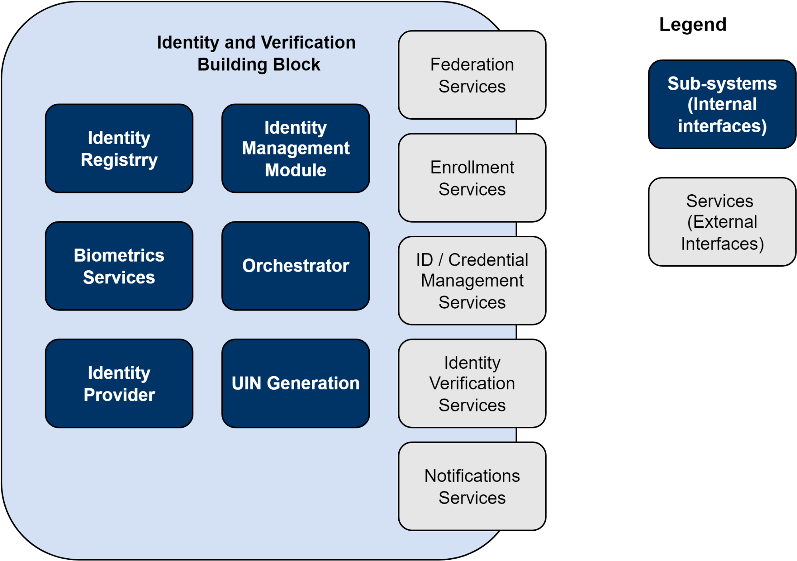

# 2 Introduction

This document is intended to provide guidance for building block working groups and developers of products that will be integrated into a GovStack implementation. It also provides guidlines for implementers and system integrators who are deploying solutions that leverage the GovStack approach. It provides guidelines and principles that should be considered by all building blocks and cross-cutting requirements that must be considered for any GovStack project.

This document is intended for building block working groups and developers. It provides guidelines and principles that should be considered by all building blocks. It also provides cross-cutting requirements that must be considered

This will accelerate the collaborative development of best-of-breed digital public goods, enhancing efficiency and transparency across the world - especially in low-resource settings.

## 2.1 GovStack and the Building Blocks Approach

GovStack aims to provide a reference architecture for digital governance software to support sustainable development goals. Rooted in a Whole-of-Government approach, the GovStack Framework provides a methodology for leveraging common technology components and infrastructure to more easily create and deploy interoperable digital platforms which can address high-priority use cases across multiple sectors.&#x20;

GovStack aims to provide a reference architecture for digital governance software to support the Sustainable Development Goals. We’ve seen the many benefits digitalization of governance can bring. We believe that leveraging a Whole-of-Government approach rooted in common building block technologies can help accelerate this process around the world.

The goal of GovStack is to accelerate the collaborative development of interoperable digital public goods, enhancing efficiency and transparency across the world - especially in deficient settings. The guidelines and requirements described in this document provide a framework for the development of digital building blocks oriented toward this goal.&#x20;

## 2.2 SDG Digital Framework Criteria

## 2.2 Criteria for Building Blocks

The following provide criteria and definitions for Building Blocks.

### SDG Digital Investment Framework

The SDG digital framework has formally defined criteria. Building blocks MUST meet the following criteria:

The following provide criteria and definitions for Building Blocks.

### SDG Digital Investment Framework

The [SDG Digital Investment Framework](https://dial.global/research/sdg-digital-investment-framework/), developed by the International Telecommunication Union (ITU) and the Digital Impact Alliance (DIAL), has formally defined criteria. Building blocks MUST meet the following criteria:

* Reusable software components
* Licensed as open source, proprietary, or freely available with Open Access to data
* Facilitates one or more generic Workflows
* Applicable to multiple SDG Use Cases across multiple sectors
* Interoperable with other ICT Building Blocks
* Designed for Scalability&#x20;
* Designed for Extensibility
* Standards Based Conformance or Compliance

### Digital Public Goods Alliance (DPGA)

Additionally, the Digital Public Goods Alliance has created a [definition of Building Blocks](https://digitalpublicgoods.net/DPI-DPG-BB-Definitions.pdf). In this definition, a building block:

[Refers to software c](#user-content-fn-1)[^1]ode, platforms, and applications that are interoperable, provide a basic digital service at scale, and can be reused for multiple use cases and contexts.

Serves as a component of a larger system or stack.

Can be used to facilitate the delivery of digital public services via functions, which may include registration, scheduling, ID authentication, payment, data administration, and messaging.&#x20;

Building blocks can be combined and adapted to be included as part of a stack of technologies to form a country’s DPI.&#x20;

Building blocks may be open source or proprietary and therefore are not always DPGs.&#x20;

“Building blocks can be as simple as a common set of rules or protocols (for example email programs like Simple Mail Transfer Protocol - SMTP), or complex (for example an open-source health information system like the DPG, District Health Information Software - DHIS2)“&#x20;

Characteristics of building blocks:&#x20;

Autonomous: building blocks provide a standalone, reusable service or set of services, they may be composed of many modules/microservices.\
Generic: building blocks are flexible across use cases and sectors.\
Interoperable: building blocks must be able to combine, connect, and interact with other building blocks.\
Iterative evolvability: building blocks can be improved even while being used as part of solutions.&#x20;

Requirement: To be considered a building block, solutions must meet the technical requirements determined by the GovStack Initiative which as of April 2022 includes: \
Open API, Open API Specifications, Rest API\
Packaged in a container\
Include a information mediator where communication is restricted through a information mediator

### Digital Public Goods Alliance (DPGA)

Additionally, the Digital Public Goods Alliance has created a [definition of Building Blocks](https://digitalpublicgoods.net/DPI-DPG-BB-Definitions.pdf). In this definition, a building block:

[Refers to software c](#user-content-fn-2)[^2]ode, platforms, and applications that are interoperable, provide a basic digital service at scale, and can be reused for multiple use cases and contexts.

Serves as a component of a larger system or stack.

Can be used to facilitate the delivery of digital public services via functions, which may include registration, scheduling, ID authentication, payment, data administration, and messaging.&#x20;

Building blocks can be combined and adapted to be included as part of a stack of technologies to form a country’s DPI.&#x20;

Building blocks should meet the criteria of the Digital Square Global Goods maturity model for Global Utility, Community and Software Quality. See\
[https://www.google.com/url?q=https://wiki.digitalsquare.io/index.php/Global\_Goods\_Maturity\&sa=D\&source=editors\&ust=1614177377366000\&usg=AOvVaw3rKLBBw5qDajPOetkDdmTv](https://wiki.digitalsquare.io/index.php/Global\_Goods\_Maturity) for details.

Building blocks may be open source or proprietary and therefore are not always DPGs.&#x20;

“Building blocks can be as simple as a common set of rules or protocols (for example email programs like Simple Mail Transfer Protocol - SMTP), or complex (for example an open-source health information system like the DPG, District Health Information Software - DHIS2)“&#x20;

Each building block deployment MUST use a security server to federate and communicate with other data consumers and providers. This ensures the confidentiality, integrity, and interoperability between data exchange parties. A security server MUST provide the following capabilities:

Characteristics of building blocks:&#x20;

Refer to the full description of the [Information Mediator Building Block](https://govstack.gitbook.io/specification/building-blocks/information-mediation) for more information.

Autonomous: building blocks provide a standalone, reusable service or set of services, they may be composed of many modules/microservices.\
Generic: building blocks are flexible across use cases and sectors.\
Interoperable: building blocks must be able to combine, connect, and interact with other building blocks.\
Iterative evolvability: building blocks can be improved even while being used as part of solutions.&#x20;

Requirement: To be considered a building block, solutions must meet the technical requirements determined by the GovStack Initiative which as of April 2022 includes: \
&#x20;  1\. Open API, Open API Specifications, Rest API\
&#x20;  2\. Packaged in a container\
&#x20;  3\. Include a information mediator where communication is restricted through a information mediator

Finally, members can be onboarded and provided with access to the security server.

## 2.3 Building Blocks

A Central Operator is responsible for maintaining a registry of members, the security policies for building blocks and other member instances, a list of trusted certification authorities and a list of trusted time-stamping authorities. The member registry and security policies MUST be exposed to security servers over HTTP.

Building blocks are software modules that can be deployed and combined in a standardized manner. Each building block is capable of working independently, but they can be combined to do much more:

Certificate authorities are responsible for issuing and revoking certificates used for securing and ensuring the integrity of federated information systems. Certificate authorities MUST support the Online Certificate Status Protocol (OCSP) so security servers can check certificate validity.

.png>)

Building blocks are composable, interoperable software modules that can be used across a variety of use cases. They are standards-based, open source and designed for scale.

Each Building Block represents, as much as possible, the minimum required functionality (MVP) to do its job. This ensures each Building Block is usable and useful on its own, and easily extensible to support a variety of use cases.

A block is composed of domain-driven microservices, modeled as closely as possible on existing roles and processes. This helps ensure each block is as useful as possible in the real world.

Building Blocks exchange data using lightweight, human-readable data that can easily be extended where needed. Data models and APIs are described in a lightweight manner that’s human-readable, allowing them to be easily and quickly understood and validated.

### 2.3.1 Building Blocks and UI/UX

A building block may also be an application which provides re-usable interfaces:

1. An **admin-only form builder** which facilitates building user interfaces (e.g., select questions to be displayed in a maternal-and-child-health registration process)
2. **User interfaces** (i.e., forms) which can be used in lieu of individual end-user apps building their own forms (e.g. I’m building a _new_ maternal and child health application; I’d like to use a registration screenflow that’s been pre-built in the registration building block as part of a larger, _composed_ application.)
3. A **public API** which exposes the critical **back-end services** performed by this BB (adding a mom to a database; checking for a mom’s enrollment status in a program) to be used (as a microservice) by existing or new applications with legacy/bespoke needs (e.g., i’ve already got a maternal and child health app that the CHWs are using, and I want to send a webhook to the registration BB after a CHW clicks “submit” on our custom form.)

## 2.4 Building Blocks Working Together

A building block is only so useful on its own. In practice, building blocks MUST be connected together in a secure, robust, trusted manner that facilitates distributed deployments and communications with existing services.

### 2.4.1 Federation and Data Exchange Requirements

Each building block deployment MUST use an Information Mediator to federate and communicate with other data consumers and providers. This ensures the confidentiality, integrity, and interoperability between data exchange parties. An Information Mediator MUST provide the following capabilities:

* address management
* message routing
* access rights management
* organization-level authentication
* machine-level authentication
* transport-level encryption
* time-stamping
* digital signature of messages
* logging
* error handling
* monitoring and alerting

Refer to the full description of the [Information Mediator Building Block](https://govstack.gitbook.io/specification/building-blocks/information-mediation) for more information.

### 2.4.2 Organizational Model

Some policies and processes need to be applied to support this methodology.

First, a central operator needs to be created. This organization will be responsible for the overall operation of the system, including operations and onboarding new members. Policies and contractual agreements for onboarding need to be created.

Trust services need to be set up internally or procured from third parties, including timestamp and certificate authorities. This provides the necessary infrastructure to support distributed deployments.

Finally, members can be onboarded and provided with access to the Information Mediator.

Once agreements are in place, members can deploy new services in a decentralized, distributed manner. Before deploying a new service, the central operator must be notified of any changes to access-rights, including organization and machine-level authentication before it can publish or consume data.

### 2.4.3 Technical Architecture

A Central Operator is responsible for maintaining a registry of members, the security policies for building blocks and other member instances, a list of trusted certification authorities and a list of trusted time-stamping authorities. The member registry and security policies MUST be exposed to the Information Mediator over HTTP.

Certificate authorities are responsible for issuing and revoking certificates used for securing and ensuring the integrity of federated information systems. Certificate authorities MUST support the Online Certificate Status Protocol (OCSP) so that an Information Mediator can check certificate validity.

Time-stamping authorities securely facilitate time stamping of messages. Time stamping authorities MUST support batched time stamping.

## 2.5 Keywords and Definitions

Within this document, the key words "MUST", "MUST NOT", "REQUIRED", "SHALL", "SHALL NOT", "SHOULD", "SHOULD NOT", "RECOMMENDED", "NOT RECOMMENDED", "MAY", and "OPTIONAL" are to be interpreted as described in [BCP 14](https://tools.ietf.org/html/bcp14) [RFC2119](https://tools.ietf.org/html/rfc2119) [RFC8174](https://tools.ietf.org/html/rfc8174) when, and only when, they appear in all capitals, as shown here.

### 2.5.1 Building Block-specific definitions

The following provides definitions for terms that are used by various building blocks.&#x20;

**Registration:** Any approval/license/certificate issued by a public entity as a result of a request/declaration made by a user of the public service. The result of a “registration” is usually a number and/or a document (called certificate, license, permit, authorization, registration, clearance, approval, etc.)

**Authentication:** This is the technical process of establishing that the credentials (i.e. username, password, biometric etc.) provided by a party (user, system, other) is valid and that the party can be granted basic access to system resources with default access rights. Note that authorization also needs to be applied for a party to access protected resources.

**Authorization:** This is the technical process of establishing whether or not an authenticated party has rights to access a given protected resource. Access rights can typically be granted or revoked administratively on a read-only and/or read-write and/or execute basis through an administrative provisioning process. Permissions or rights defined for a party typically manifest in an access token that is granted at the time of authentication for the party. Hence the processes of authentication and authorization are intrinsically related.

**Workflow**[ **** ](https://docs.google.com/document/d/1TIQ756eWauQLNeSWUqfm5dpDz\_wJsesfZgXBiWXLx9w/edit#heading=h.8dexf2kkoftd)**Terminology:** See more comprehensive descriptions of the workflow terminology in the [Workflow and Business Process Automation Building Block specification](https://govstack.gitbook.io/specification/building-blocks/workflow).

* (Workflow) Activity - a single step in a workflow process.
* (Workflow) Process - a workflow process contains one or many activities.
* (Workflow) Instance - an instance of execution for a workflow process.

##

[^1]: 

[^2]: 
