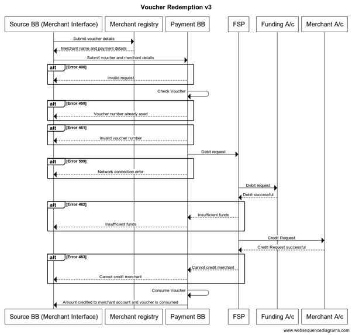
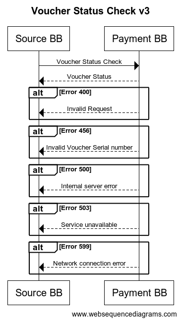

# 9 Service APIs

## 9.1 Incoming Payments to Government (P2G) <a href="#docs-internal-guid-83db42bd-7fff-3768-b76a-9586be4ab890" id="docs-internal-guid-83db42bd-7fff-3768-b76a-9586be4ab890"></a>

The implementation will be such that a “Request to Pay” APIs is exposed and the Gov't Ministry (entity) is treated as a type of Biller. Refer to the [GSMA API ](https://developer.mobilemoneyapi.io/1.2/content/merchant-payments)&#x20;

### 9.1.1 Payee-Initiated Merchant Payment

The government entity initiates the request to the FSP and will be credited when the payer approves the request. This API covers the  use case where the mother pays for registration payment.

```
{
    "amount": "200.00",
    "id": "2",
    "debitParty": [
        {
            "key": "accountid",
            "value": "2999"
        }
    ],
    "creditParty": [
        {
            "key": "accountid",
            "value": "2999"
        }
    ],
    "currency": "RWF"
}
```

### 9.1.2 Payer-Initiated Merchant Payment <a href="#docs-internal-guid-bfb99f40-7fff-cdda-fef1-dd6367f348ff" id="docs-internal-guid-bfb99f40-7fff-cdda-fef1-dd6367f348ff"></a>

The payer initiates the request and will be debited upon successful completion of the request.

```
{
    "amount": "200.00",
    "debitParty": [
        {
            "key": "accountid",
            "value": "2999"
        }
    ],
    "creditParty": [
        {
            "key": "accountid",
            "value": "2999"
        }
    ],
    "currency": "RWF"
}
```

## 9.2 Bulk Payment APIs (Outgoing) <a href="#docs-internal-guid-f78d8d0a-7fff-33bf-2d15-aced73dc0f65" id="docs-internal-guid-f78d8d0a-7fff-33bf-2d15-aced73dc0f65"></a>

There are APIs:

* that  connect the Payments Building Block to the Source of Payee (Beneficiary system) &#x20;
* for sending bulk payments through the gateway to the FSPs.&#x20;
* APIs for doing lookup of identity and maps to valid bank or wallet accounts.  As noted previously, third party providers, depending on the topography of the payments landscape in the country may bring additional APIs to connect to the FSPs. Those are out of scope.

APIs for querying the payments building block for information about a batch job, payments made under a specific program over time, and specific payment enquiries for a specific date, beneficiary, or any combination.&#x20;

## 9.3 From Source Beneficiary System to Payments Building Block

### 9.3.1 Programs &#x20;

(noun, meaning a program that sends funds to beneficiaries)

```
POST/program
Create Program 
GET/programs
Get all Programs
GET/program/{program_id}
Get Program by id
```

### 9.3.2 Beneficiaries  <a href="#docs-internal-guid-cde102bb-7fff-c41c-15d5-24f7a917aa16" id="docs-internal-guid-cde102bb-7fff-c41c-15d5-24f7a917aa16"></a>

(noun, meaning a payee of a program)&#x20;

```
GET/beneficiaries
Get Beneficiaries (list of beneficiaries) 

GET/beneficiary/{beneficiary_id}
Get Beneficiary by id
"beneficiaries": [
      {
        "id": 9,
        "firstname": "Mitta",
        "lastname": "Agarwal",
        "email": "",
        "mobile": "",
        "active": true,
        "activity_ids": [],
        "activity_state": "",
        "activity_summary": "",
        "bank_account_id": {
          details here        },
         "identity_data_kyc": {
          "passport_id": "",
          "national_id": "",
          "ssn": ""
        },
        "identities": {},
        }
      },
*note that we don’t assume KYC is handled by GovStack

PUT/beneficiary/{beneficiary_id}/kyc
       Update Beneficiary KYC

PUT/beneficiary/{beneficiary_id}/Provider  
Update Beneficiary Financial Service Provider 

POST/enroll-into-program
Enroll into a Program

        POST/de-enroll-from-program 
                De-enroll beneficiary from a program 
```

### 9.3.3 Disbursement  <a href="#docs-internal-guid-907cf93b-7fff-35b1-fa01-cc96cad61e4f" id="docs-internal-guid-907cf93b-7fff-35b1-fa01-cc96cad61e4f"></a>

(verb, relating to sending funds in a batch)&#x20;

## 9.4 From Payments Building Block to Lookup Directories (or Similar)  <a href="#docs-internal-guid-242b48cd-7fff-dabe-9b24-4b63c44077d0" id="docs-internal-guid-242b48cd-7fff-dabe-9b24-4b63c44077d0"></a>

[Account-Lookup Service · GitBook (mojaloop.io)](https://docs.mojaloop.io/documentation/mojaloop-technical-overview/account-lookup-service/)

## 9.5 From Payments Building Block: Bulk Payment to FSPs

```
GET /batch
Batch Summary
GET /batch/detail
Batch Details

POST/transfer… 
see https://app.swaggerhub.com/apis/myapi943/payment-hub_ap_is/1.0#/ 
```

## 9.6 Voucher APIs (Outgoing) <a href="#docs-internal-guid-9cf2815f-7fff-7e39-e7ed-207134468ff3" id="docs-internal-guid-9cf2815f-7fff-7e39-e7ed-207134468ff3"></a>

The first API call (pre-activation) is a request for a voucher of a specific value in a specific currency.  The API call may also include a voucher group  indicating that the voucher is to be used for a specific purpose. The voucher management server will respond with a voucher number - typically a 16-digit code,  a voucher serial number and the expiry date, The voucher would be marked in a pre-activated state.

&#x20;The second API call (activation) is a request to activate a pre-activated voucher. This call would send the voucher number to the Payment Building Block to have the voucher activated.

&#x20;The third API call (redemption) sends the serial number, the voucher number and the merchant payment details to the Payment Building Block. If the voucher details are valid, the merchant is credited and the voucher is consumed,

A fourth API allows for batch activation of vouchers through an encrypted file. The source file would contain details on the amount, the currency and the voucher group while the encrypted response file would contain the voucher serial number, the voucher number and the expiry date.

A last set of APIs are available for checking the status of a voucher as well as canceling a voucher.

### 9.6.1 VoucherPreActivation API

The VoucherPreActivation API is used by non-Payment Building Blocks in the GovStack Framework to request for a voucher to be used. This call reserves the voucher (for a period, which is to be implemented). This API requests a single voucher from the voucher server that can be used for a future redemption process. The caller sends an amount, a voucher group (depending on the use case), the currency and the name of the calling GovStack Building Block. If the API call is successful, the Payment Building Block will respond with a voucher number, a voucher serial number and an expiry date.

.png>)

### 9.6.2 VoucherActivation API <a href="#docs-internal-guid-53943e9f-7fff-ee8a-93a6-10bc57857bd7" id="docs-internal-guid-53943e9f-7fff-ee8a-93a6-10bc57857bd7"></a>

The VoucherActivation API is used by non-Payment Building Blocks in the GovStack Framework to activate a pre-activated voucher. This second function call is intended to ensure that the voucher is only activated when it is disbursed. This API requests for the activation of a voucher when the caller sends the voucher number to be activated. If the API call is successful, the activation is confirmed, and the voucher can now be used by the beneficiary.

.png>)

### 9.6.3 BatchVoucherActivation API <a href="#docs-internal-guid-97c3ee48-7fff-63bc-1eda-a2af444b93bb" id="docs-internal-guid-97c3ee48-7fff-63bc-1eda-a2af444b93bb"></a>

The BatchVoucherActivation API is used by a calling BB to activate vouchers in bulk. This may be used for bulk social cash transfers where the recipients receive benefits by vouchers. The calling BB is responsible for generating the beneficiary file as well as dispensing of the vouchers. The Payment BB is responsible for generating and redeeming the vouchers codes. Both BBs will have had to have exchanged encryption keys at the implementation phase.

The file provided by the calling building block (typically the scheduler building block) will typically contain a unique identifier, an amount of the voucher required, the currency of the voucher and voucher group. While the file format may vary, the recommended file format is an encrypted json file.

If the file is properly formatted, the Payment BB will respond with a file that contains the unique ID that was sent with, the status, the voucher number, the voucher serial number and the expiry date of the voucher. The response file will also be an encrypted file to ensure the appropriate security of the voucher number.

The calling building block will dispense the vouchers as needed using an appropriate delivery mechanism. The calling BB will also be responsible for any verification of the beneficiary during the redemption process. The description of the dispensing of the vouchers once the calling block has received it is outside the scope of the Payments BB.


### 9.6.4 VoucherRedemption <a href="#docs-internal-guid-df8c2024-7fff-e374-7456-23db45c11b57" id="docs-internal-guid-df8c2024-7fff-e374-7456-23db45c11b57"></a>

The VoucherRedemption API is used by non-Payment Building Blocks in the GovStack Framework to redeem a voucher. The calling Building Block will capture the voucher number and the voucher serial number from the merchant point. The external Building Block will also acquire the merchant name and payment details from the merchant registry. The calling Building Block will then send the voucher number, the voucher serial number, the merchant’s name and payment details. The Payment Building Block will verify that the voucher has been activated and has not been used or blocked or cancelled. If so, the Payment Building Block will then send a payment request to the funding agency / FSP. The Payment Gateway of the Payments Building Block will facilitate the debit of the funding account, and the credit of the merchant as well as handle any intermediary fees. Once the payment has been successfully done the Payment Building Block will mark the voucher as consumed and notify the merchant (and beneficiary if possible).



### 9.6.5 VoucherStatus API <a href="#docs-internal-guid-14288f23-7fff-3b24-f10e-6fb6e3200147" id="docs-internal-guid-14288f23-7fff-3b24-f10e-6fb6e3200147"></a>

The VoucherStatus API is used by non-Payment Building Blocks in the GovStack Framework to check the status of a voucher. The calling Building Block will capture the voucher number and send it to the Payments Building Block to determine the status of a voucher. The Payments Building will respond with one of the statuses of Pre-Activated, Activated, Suspended, Blocked or Not Existing.



### 9.6.6 VoucherCancellation API <a href="#docs-internal-guid-ceb6fd44-7fff-a34f-207b-6fc5be1638fa" id="docs-internal-guid-ceb6fd44-7fff-a34f-207b-6fc5be1638fa"></a>

The VoucherCancellation API is used by non-Payment Building Blocks in the GovStack Framework to cancel a voucher. The calling Building Block will capture the voucher number and send it to the Payments Building Block to cancel the voucher. The Payments Building Block will respond with a status of Cancelled, Already Cancelled or Not existing. The VoucherCancellation will override the Blocked status and render the voucher permanently unusable.6.6

#### **9.6.6.1 Response Status Codes**

Status codes in the 200 range imply that the request completed normally, the 300 range indicate that the request must be present to a different location. Status codes in the 400 or 500 ranges imply that there was an error executing the request.

**Used Response Codes**

| **Response codes**          | **Description**                                                                                                 |
| --------------------------- | --------------------------------------------------------------------------------------------------------------- |
| 200 (ok)                    | Sent when the request completed successfully.                                                                   |
| 202 (Accepted)              | <p>The request has been accepted for processing, but the processing has not been completed</p><p>(pending).</p> |
| 401 (Unauthorised)          | The request needs authentication.                                                                               |
| 403 (Forbidden)             | The request was denied, and will be denied also in the future.                                                  |
| 404 (Not Found)             | The target resourceresource specified in the URI was not found.                                                 |
| 500 (Internal Server Error) | The server encountered a general error during execution.                                                        |
